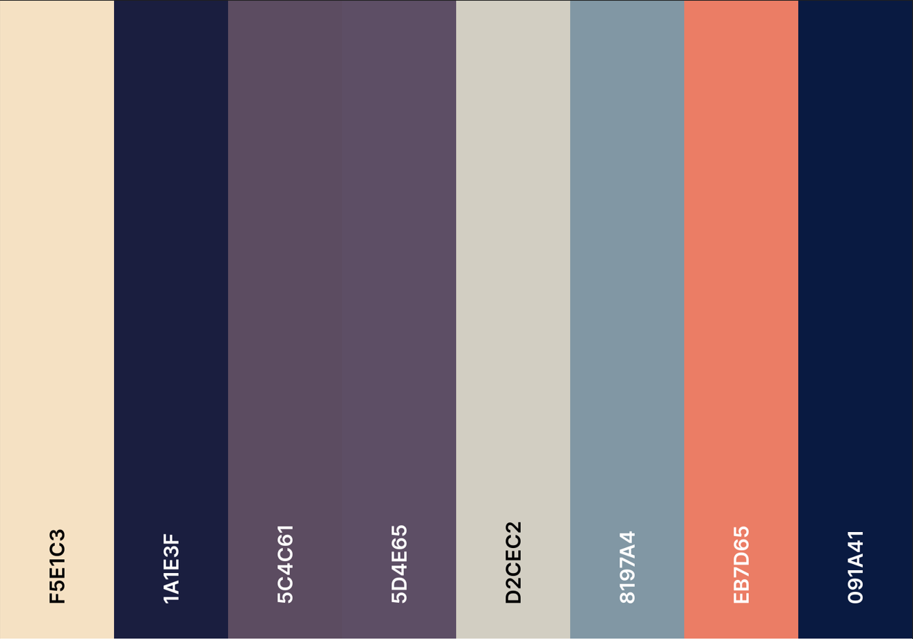

# Neovim Configuration --> VimJu

Hello there! 👋 I'm Julius Olsson, the creator of Nordwebb and a passionate developer from Sweden. This repository contains my personal Neovim configuration files, which I've tailored for optimal development efficiency and ease of use.

The plan is to continue to develop this until it is a complete Neovim IDE

## About the Configuration

This Neovim setup is crafted with care, incorporating the best practices I've gathered throughout my coding journey. It includes a range of plugins and custom settings that aim to enhance the coding experience, whether I'm working on web development projects or exploring new programming languages.

### Key Features:

- **Autocompletion:** Streamlined code completion with nvim-cmp for various programming languages.
- **LSP Support:** Integrated language server protocol configuration to ensure seamless coding and debugging.
- **Visual Enhancements:** Custom themes and a status line setup with lualine for a visually appealing workspace.
- **Productivity Boosters:** Key mappings and which-key integration to speed up common actions.
- **Smooth Navigation:** Flash.nvim for efficient code traversal and neoscroll for fluid scrolling.
- **Treesitter Integration:** Advanced syntax highlighting and code manipulation features.

## Installation

To use this configuration:

1. Ensure Neovim is installed on your machine.
2. Clone this repository into your Neovim configuration directory, usually located at `~/.config/nvim/`.
3. Open Neovim and run `:PackerSync` to install and compile the plugins.

## Customization

Feel free to fork this repository and customize the configuration to fit your workflow. The setup is modular, making it easy to add or remove components as needed.

## Connect with Me

I'm always open to discussing technology, programming, and potential collaborations. If you're interested in the work I'm doing or would like to share ideas, please reach out through any of the following channels:

- [LinkedIn](https://www.linkedin.com/in/julius-olsson-5432b3269)
- [Quora](https://www.quora.com/profile/Julius-Olsson-1-1)
- [Email](mailto:julius.olsson05@gmail.com)
- [Website](https://www.nordwebb.com) (In Swedish)

## My Modifications

In my quest to optimize my development workflow, I've added a couple of custom scripts to my Neovim configuration. These scripts help me debug and navigate projects more efficiently.

### Python Terminal Error Formatter

When developing Python applications, encountering errors is part of the process, especially when dealing with complex frameworks like Django. To streamline debugging, I've added a script that formats and presents errors in a more digestible manner. By running the command `:TerminalErrors` within Neovim, the script generates a quicklist of all the files where errors occurred, along with the specific line numbers. This feature is particularly helpful for quickly pinpointing and resolving import errors or other common issues that might halt development.

### PowerShell Tree Command

Navigating project directories and sharing their structures can be cumbersome at times. To address this, I've created a PowerShell tree command that integrates with Neovim. By typing `:Tree {MaxDepth}` in the command line, I can easily generate and visualize the directory tree of the current project up to the specified depth. This command is not only useful for my own navigation but also allows me to effectively communicate the project structure to fellow developers on the team.

## Acknowledgements

A special thanks to the creators and contributors of the plugins and tools used in this setup. Your work is greatly appreciated and has been instrumental in refining my development environment.

---

Happy coding!

Julius Olsson

